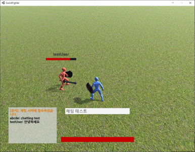

이미지 클릭 시 시연 유튜브 영상으로 이동

# 프로젝트 개요
- 유니티와 C# 데디케이티드 서버를 사용한 최대 4인 실시간 대전 게임.
- 다양한 동기화 기법을 적용하여 지연 환경에서도 일관되고 합리적인 플레이 경험을 제공

## 개발 정보
- 개발 인원: 1인
- 클라이언트: Unity
- 서버: C# .NET TCP 소켓 기반 데디케이티드 서버

## 주요 기능
### 🔧 네트워크 구조
- 클라이언트 예측 (Client-side Prediction)
  클라이언트는 사용자의 입력을 서버에 전송하는 동시에, 해당 입력을 즉시 로컬에서 적용하여 움직임을 예측.
  서버로부터 authoritative한 위치가 도착하면, 클라이언트는 자신의 위치와 서버 위치를 비교하고 오차가 존재할 경우 보정하여,
  이를 통해 네트워크 지연이 있는 환경에서도 즉각적인 조작감을 유지.
- 서버 재조정 (Server Reconciliation)
  서버는 클라이언트 입력을 기준으로 위치를 계산하고, 모든 이동 로직은 서버에서 최종적으로 검증하고 authoritative하게 처리.  
  서버는 최신 위치를 클라이언트에 주기적으로 전송하며, 클라이언트는 이를 기반으로 자신의 위치를 수정.
- 지연 보상 (Lag Compensation)
  클라이언트가 입력한 동작이 서버에 도달할 때까지의 지연을 보정하기 위해, 서버는 과거 시점의 게임 상태를 재현할 수 있도록 플레이어 위치 기록을 저장.
  공격 판정이나 충돌 판정 시 해당 시점을 기준으로 위치를 복원하여 정확한 판정을 수행.
- 데드 레커닝 기반 캐릭터 위치 보간
  서버는 다른 플레이어들의 위치를 일정 주기로 브로드캐스트하며, 클라이언트는 이를 수신한 후 마지막 위치와 이동 방향을 기반으로 다른 플레이어의 이동을 예측.

### 🧩 상태 관리 시스템 (클라이언트)
- 상태 패턴(State Pattern)을 사용하여 플레이어의 상태를 모듈화
- 각 상태(`Idle`, `Move`, `UsingSkill`, `Dead`)는 독립 클래스로 구현되어, 책임이 명확하고 확장에 유리
- Enter(), Exit(), Update() 메소드를 구현하여 상태 전환을 관리

### 🧠 서버 아키텍처
- 권위적인(Authoritative) 서버 모델
- byte 배열 기반의 패킷 구조

### 🎮 게임 플레이
- 최대 4인 실시간 대전
- 평타 / 회피 / 방어 스킬 사용 가능

## Based On
Packet 구조 및 직렬화 방식은 해당 프로젝트를 기반으로 확장/최적화 하였습니다.
[tom-weiland/tcp-udp-networking](https://github.com/tom-weiland/tcp-udp-networking)

## 참고 자료
https://www.gabrielgambetta.com/client-server-game-architecture.html
https://developer.valvesoftware.com/wiki/Source_Multiplayer_Networking
https://noti.st/eiaserinnys/jCpSbp
https://blog.naver.com/linegamedev/221061964789
